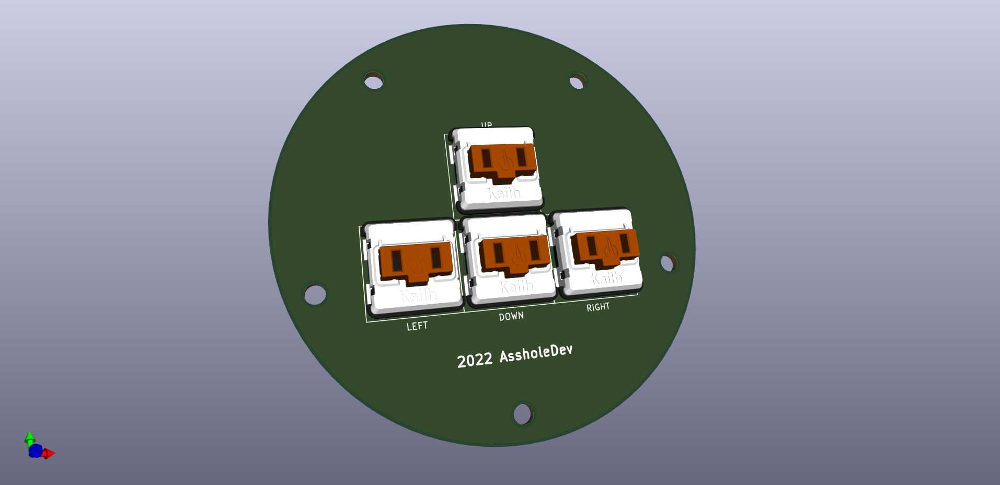
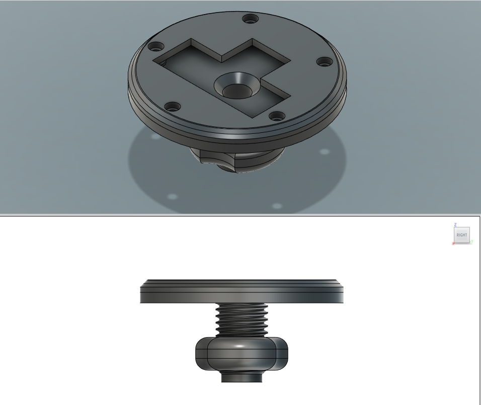
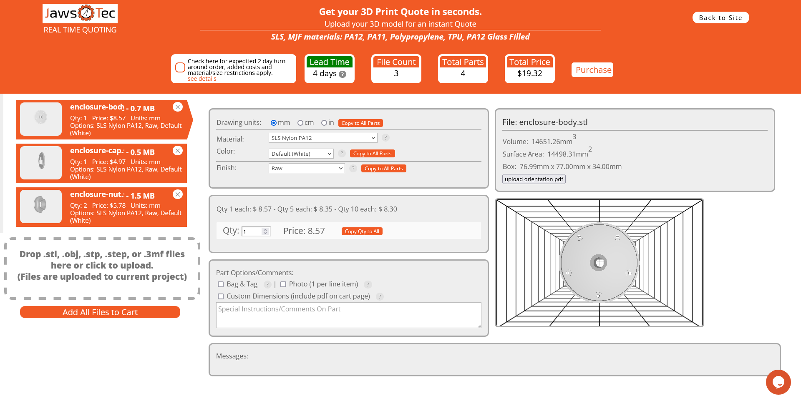
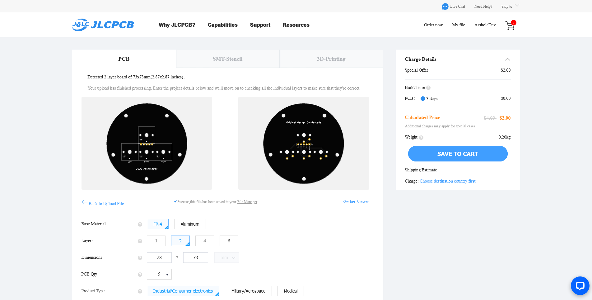

# AssholeKeys

I wanted to convert my Qanba Pearl into a MixBox and found out about the [Odin V2](https://www.etsy.com/listing/966780358/odin-v2-the-drop-in-fightpad), but it's sold out and there's a long wait list. Besides, I don't like the look of FDM 3d printing, so I made this last night as a drinking project.

## Is this meant to compete with the Odin V2?
Not at all. This is meant to be used while waiting for the real thing. I made it inferior on purpose with the goal of spending as little money as possible. There are no LEDs, no fancy conectors, the nuts aren't self centering and the design is not as well thought as the original. I mean I made it in a sitting while downing a bunch of whisky, FFS. Still, it should be good enough to work.

## Why the name?
Because I still feel like an asshole, this is a complete ripoff of the original thing.

## To get the enclosure:

Download and extract this repo. Then go to to the enclosure/STL folder. Go to [Jawstec](https://app.jawstec.com/3d-print-quote/) and upload the STL files. Select SLS nylon PA12 as your material and set the nut Qty to 2. Place your order and wait a couple of weeks.

## To get the PCB
Go to [JLCPCB](https://cart.jlcpcb.com/quote) and upload the AssholeKeys-JLCPCB.zip file located in the gerbers folder. Choose your PCB color and quantity and leave all other options at their default settings. Place your order and wait for a couple of weeks.

Then all you need is solder some [Kailh chocs](https://www.aliexpress.com/item/4000907409650.html), pop some keycaps, assemble and off you go! 

## Contributions and modifications
You need KiCad for the PCB. The project files are in the AssholeKeys.zip files in the root folder. If you send a pull request with changes to the PCB, please make sure you also [generate new gerbers](https://support.jlcpcb.com/article/194-how-to-generate-gerber-and-drill-files-in-kicad-6) so that new users can send your updated version to manufacture.

For the enclosure, you can use whatever CAD app you want, but please, also make sure to include newly generated STEP and STL files.

## Acknowledgements
The credit for the original author goes to OmniArcade. Do yourself a favor and get one of his as well.